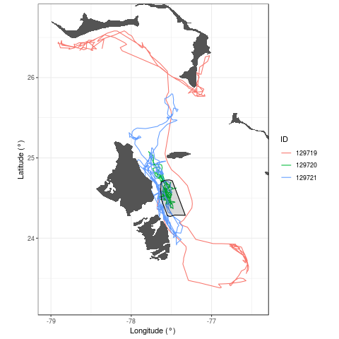

Overiew
-------

`R` package to fit two-stare continuous-time discrete-space Markov
models with individual level random effects. Methodology was developed
with [Enrico Pirotta](mailto:pirotta.enrico@gmail.com) to assess the
effects of exposure to Navy sonar on marine mammal movement patterns.

Installation
------------

To install the `mmre` package run

    devtools::install_github("cmjt/mmre")
    library(mmre)

All model likelihoods are coded using `TMB`; in oder to compile all
`TMB` templates after installation run

    compile.mmre()

and to load the templates run

    dll.mmre()

once in each workspace.

Example
-------

The `mmre` package contains an example dataset, `example$data`, of three
individuals on the AUTEC Naval range (see figure below). The `state`
variable indicate if an individual was off (state = 1) or on (state = 2)
range (black polygon in figure). `Id` is the individual ID
(individual\_i for i = 1,2,3). The `time` column gives the relative
times os the observations in days and the `t.since` column gives, in
days, the time since an individual was esposed to Navy sonar activity.

Estimated tracks on and around the AUTEC Naval range

    data(example)

To fit a simple two state continuous-time Markov model run

    mod.basic <- fit.mmre(data = example$data,parameters = list(log_baseline = log(c(0.5,0.5))))

and to get the estimated transition probability matrix P(t = 1)

    get.probs(mod.basic,1)
    >           State 1   State 2
    > State 1 0.7909891 0.2090109
    > State 2 0.6358045 0.3641955

To compare the results to the `msm` package run

    library(msm)
    msm.fit <- msm(state ~ time, subject = ID, data = data, qmatrix = rbind(c(0, 0.5), c(0.5, 0)),  
        exacttimes = FALSE)
    pmatrix.msm(msm.fit)

### Model with individual level random effects

    mod.basic.re <- fit.mmre(data = example$data,parameters = example$parameters.basic.re)

    get.probs(mod.basic.re,1)
    >           State 1   State 2
    > State 1 0.7915378 0.2084622
    > State 2 0.6361253 0.3638747

### Model with exponential decay effect of covariate and individual level random effects

    mod.decay.re <- fit.mmre(data = example$data,parameters = example$parameters.decay.re, decay = TRUE, cov.names = "t.since")

    get.coefs(mod.decay.re)
    > $baseline_transition_matrix
    >                     Estimate Std. Error
    > State 1 - State 1 -0.5931725  0.1704081
    > State 2 - State 1  0.9126690  0.3200735
    > State 1 - State 2  0.5931725  0.1704081
    > State 2 - State 2 -0.9126690  0.3200735
    > 
    > $covariates
    >                           Estimate Std. Error
    > State 1 - State 2 jump  -1.0700831  1.0944462
    > State 1 - State 2 decay  2.1356510  3.8955053
    > State 2 - State 1 jump   2.0187788  0.6631298
    > State 2 - State 1 decay  0.5100708  0.3137365
